# Vibe editing: asynchronous voice-to-edit with AI agents

This project demonstrates an AI-powered, asynchronous workflow that transforms spoken ideas into precise, reviewable document edits.

## Workflow diagram

```mermaid
graph TD
    subgraph " "
        IntegA["✨ Integrator Agent"]
        OV["📚 Obsidian Vault"]
        IntegA -- "Updates" --> OV

    end

    subgraph " "
        U["🧑‍💻 User"]
        VN["📝 Voice Note"]
        IA["🤖 Instruct Agent"]
        IIF["📃 Instructions File"]

        U --> VN
        VN --> IA
        IA --> IIF
        
    end

    IIF --> IntegA
    IntegA --> IIF

    style U fill:#D6EAF8,stroke:#333,stroke-width:2px
    style VN fill:#FCF3CF,stroke:#333,stroke-width:2px
    style IIF fill:#FCF3CF,stroke:#333,stroke-width:2px
    style OV fill:#E8DAEF,stroke:#333,stroke-width:2px
    style IA fill:#ABEBC6,stroke:#333,stroke-width:2px
    style IntegA fill:#ABEBC6,stroke:#333,stroke-width:2px
```


## Setup

### Requirements

*   **Python 3.x**
*   **`llm` CLI tool:** For interacting with LLMs.
*   **`rich` Python library:** For rich terminal output.
*   **An LLM:** Configured with `llm` (e.g., `gemini-2.5-flash-preview-04-17`).
*   **Unix-like Environment:** For named pipes.

### Installation

1.  **Clone the repository:**
    ```bash
    git clone https://github.com/azhutov/vibe-editing.git
    cd vibe-editing
    ```

2.  **Install Python dependencies:**
    ```bash
    pip install llm rich
    ```

3.  **Install an `llm` model plugin:**
    The `instruct_agent.py` script uses `gemini-2.5-flash-preview-04-17`. Install `llm-gemini` and configure your API key (https://aistudio.google.com/apikey).
    ```bash
    llm install llm-gemini
    llm keys set gemini
    ```

4.  **Create data directories:**
    ```bash
    mkdir -p data/voice-notes-demo data/transcripts data/integration_instructions
    ```

## How to start the workflow in Cursor

The workflow involves two AI agents: the `Instruct Agent` (processes voice notes) and the `Integrator Agent` (waits for instructions).

1.  Open Cursor in the `vibe-editing` project root.
2.  Run the Integrator Agent in Cursor chat with claude-3.7-sonnet model:
    ```
    Run @integrator_workflow
    ```
    This will start both agents and guide you through the process.
